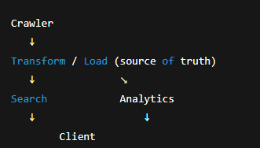

v2.0.0
          ┌───────────────────────────┐
          │      Product Table        │
          │---------------------------│
          │ id, name, variant, brand  │
          │ category, shop, price     │
          │ embedding (precomputed)   │
          │ canonical_id (prec embedd)│
          └─────────────┬─────────────┘
                        │
                        │
                        ▼
       ┌─────────────────────────────────┐
       │  Layer1: Search API             │
       │  Input: user query             │
       └─────────────────────────────────┘
                        │
          ┌─────────────┴─────────────┐
          │                           │
          ▼                           ▼
┌───────────────────┐       ┌─────────────────────┐
│  Query embedding  │       │ Semantic filter:    │
│ (generated live)  │       │ cosine similarity   │
└───────────────────┘       │ query vs product    │
                            │ embeddings          │
                            └─────────┬───────────┘
                                      │
                                      ▼
                          ┌─────────────────────┐
                          │  Top-N products     │
                          │  semantically       │
                          │  relevant           │
                          └─────────┬───────────┘
                                    │
                                    ▼
                         ┌──────────────────────┐
                         │ Aggregate by         │
                         │ canonical_id         │
                         │ (prec embedd)        │
                         └─────────┬────────────┘
                                   │
                                   ▼
                     ┌─────────────────────────┐
                     │ Merge lexicographically │
                     │ (live merge of offers)  │
                     │ - match urls            │
                     | - match name, variant   |
                     │ - merge by external_id  │
                     │ - fuzzy match           │
                     └─────────┬──────────────┘
                                   │
                                   ▼
                      ┌────────────────────────┐
                      │ Aggregated product     │
                      │ clusters:              │
                      │ id = canonical_id      │
                      │ offers combined        │
                      │ relevance scored       │
                      └─────────┬─────────────┘
                                   │
                                   ▼
                        ┌─────────────────────┐
                        │  Layer2: Offers API │
                        │  Get offers for     │
                        │  canonical_id       │
                        └─────────────────────┘

Stage 1: Recall (broad, semantic)
Stage 2: Precision (strict, lexical)

v3.0.0
User Query
     │
     ▼
+-----------------------+
| Normalize & Embed     |
| (query_embedding)     |
+-----------------------+
     │
     ▼
+-----------------------+
| Semantic Search       |
| (semantic_id ≥ 80%)   |
| → Broad product cluster|
+-----------------------+
     │
     ▼
+-----------------------+
| Fetch Cluster Offers  |
| from DB/cache         |
+-----------------------+
     │
     ▼
+-----------------------+
| Identity Resolution   |
| 1️⃣ Precomputed identical_id (90% ML + 95% fuzzy)
| 2️⃣ Precomputed similar_id (80% ML + 85% fuzzy)
| 3️⃣ Remaining offers
+-----------------------+
     │
     ▼
+-----------------------+
| Cluster-Level Sorting |
| - identical_id first  |
| - similar_id next     |
| - others last         |
| - Within each group:  |
|   cosine + fuzzy +    |
|   price + stock       |
+-----------------------+
     │
     ▼
+-----------------------+
| Optional LLM Top 3    |
| Recommendation        |
| - Highlights best     |
|   offers per cluster  |
+-----------------------+
     │
     ▼
User Sees:
- Truly identical items first
- Similar alternatives next
- Loosely related products last
- Best 3 offers highlighted (if LLM enabled)
